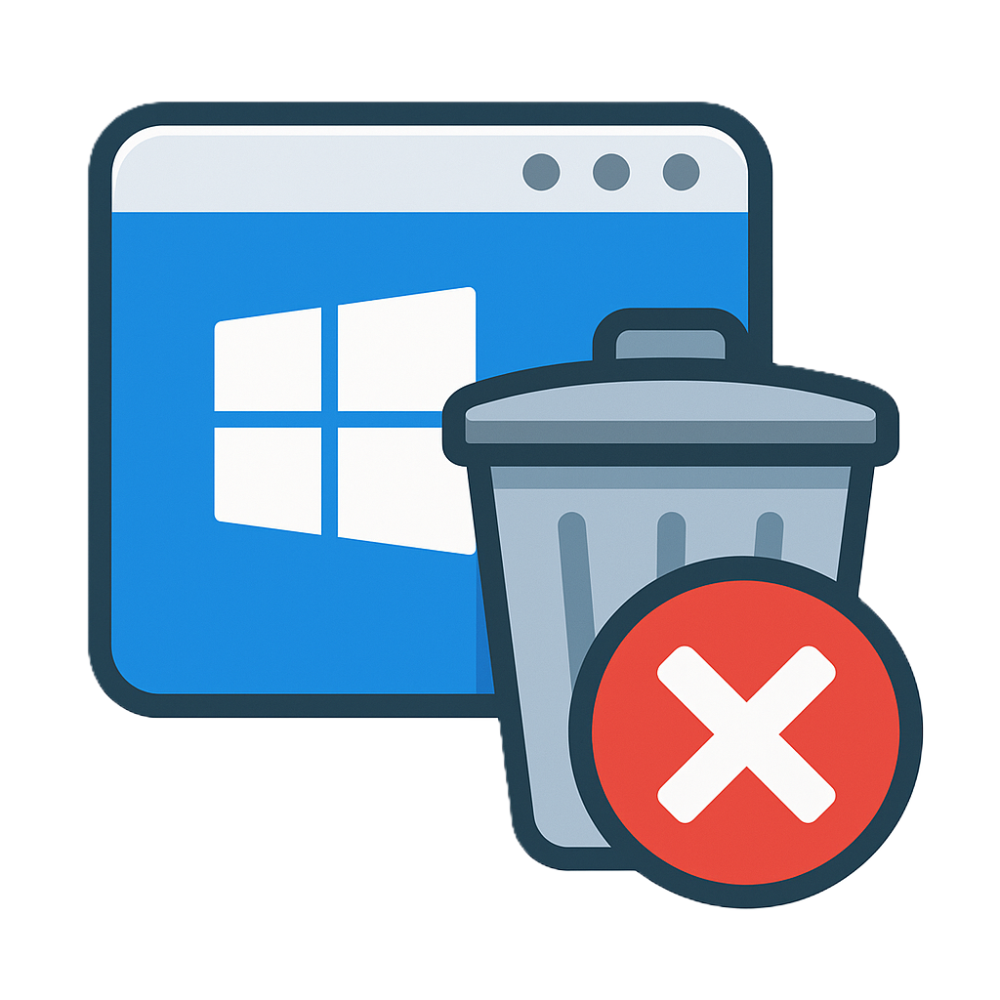

# DebloaterPro - Windows Optimization Tool

DebloaterPro is a comprehensive Windows optimization tool that helps you remove bloatware, enhance privacy, manage services, apply system tweaks, and perform maintenance tasks with ease.

## Features

### 🗑️ Debloater Module
- Remove pre-installed Windows apps and bloatware
- Filter apps by risk level (Safe, Moderate, Critical)
- Select recommended apps for removal (LTSC-style)
- View detailed app information before removal

### 🔒 Privacy Module
- Disable telemetry and data collection
- Manage activity history and diagnostics
- Control location and sensor access
- Configure app permissions and background access

### ⚙️ Services Module
- View and manage Windows services
- Recommended service configurations
- Toggle service status (Start/Stop)
- Set service startup type

### 🛠️ Tools Module
- System maintenance (temp files, disk cleanup)
- Windows Update cleanup
- Drive optimization and analysis
- System file checker and repair
- Registry backup and management

### 🎛️ Tweaks Module
- Performance tweaks (Superfetch, power plans)
- Privacy tweaks (Cortana, Game Bar, Tips)
- Network optimizations (DNS, throttling)
- One-click optimization presets

## Installation

1. Download the latest release from the [Releases page](https://github.com/MEHDIMYADI/DebloaterPro/releases)
2. Run the installer (or portable executable)
3. Follow the on-screen instructions

## Requirements

- Windows 10/11 (64-bit)
- .NET 6.0 Runtime (included in installer)
- Administrator privileges

## Usage

1. Launch DebloaterPro
2. Select the module you want to use from the navigation panel
3. Review the options and make your selections
4. Click "Apply" to execute changes
5. Restart your computer when prompted for changes to take full effect

## Screenshots

### Screenshot 1
[.png)](Screenshots/Screenshot%20(1).png)

### Screenshot 2
[.png)](Screenshots/Screenshot%20(2).png)

### Screenshot 3
[.png)](Screenshots/Screenshot%20(3).png)

### Screenshot 4
[.png)](Screenshots/Screenshot%20(4).png)

### Screenshot 5
[.png)](Screenshots/Screenshot%20(5).png)

### Screenshot 6
[.png)](Screenshots/Screenshot%20(6).png)

### Screenshot 7
[.png)](Screenshots/Screenshot%20(7).png)

## Contributing

Contributions are welcome! Please fork the repository and submit a pull request.

## License

MIT License - See [LICENSE](LICENSE) for details.

## Disclaimer

This software is provided as-is. Use at your own risk. The developers are not responsible for any system instability or data loss that may occur from using this tool. Always create a system restore point before making significant changes to your system.

---

**GitHub**: [github.com/MEHDIMYADI](https://github.com/MEHDIMYADI)  
**Project**: [DebloaterPro](https://github.com/MEHDIMYADI/DebloaterPro)
